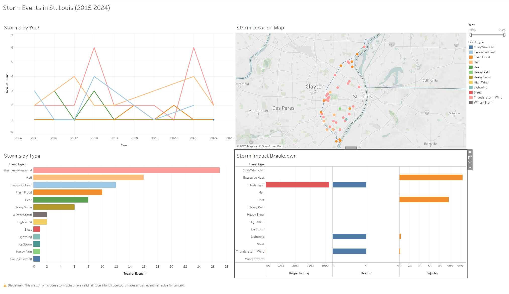

# 🌪️ St. Louis County Storm Analysis (2015–2024)

- 

  

This project explores storm events reported in St. Louis County, Missouri over the past decade using data from the National Weather Service. Using Tableau, I visualized trends, impact, and narratives behind storms such as hail, thunderstorm winds, and excessive heat.

## 📊 Tools Used
- **Tableau** – for interactive visualization
- **Python / Pandas** – for data cleaning

## 📈 Key Insights
- Storm activity peaks in late spring and early summer
- Thunderstorm winds and hail are the most common storm types
- Some events caused notable property damage and injuries
- Storms with valid location and narrative data are shown on the interactive map

## 🗺️ Tableau Dashboard

👉 [View the Live Dashboard on Tableau Public][https://public.tableau.com/app/profile/benjamin.kovacevich/viz/10YearsofStormEventsinSt_Louis/Story1]

> ⚠️ _Note: Only events with valid latitude/longitude and narrative descriptions are included on the map._

## 📁 Files
- `stl_storms_cleaned.csv`: Cleaned dataset used in Tableau
- `storm_dasboard.jpeg`: Screenshot of the published dashboard

---

## 📬 Contact
If you have questions or feedback, feel free to reach out via GitHub or connect on LinkedIn.
